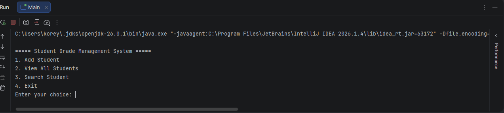

# Student Grade Management System

A Java console application that manages student records and grades using object-oriented programming principles.

## Overview

This project demonstrates Java programming concepts including object-oriented design, ArrayLists, file handling, and user input management. The application allows users to create student records, assign grades, view information, and store data for future use.
## Features

- Add new students
- Store and manage student grades
- View all student records
- Search for students
- Save and load student data using file handling

## Technologies Used

- Java
- Object-Oriented Programming (OOP)
- ArrayLists
- File I/O
- Git/GitHub

## Project Structure

- `Main.java` - Handles user interaction and program flow
- `Student.java` - Represents student objects and grade management
- `GradeManager.java` - Manages student records
- `FileManager.java` - Handles saving and loading data

## How to Run

1. Clone this repository
2. Open the project in IntelliJ IDEA
3. Run `Main.java`

## Future Improvements

- Add a graphical user interface (GUI)
- Add a database for permanent storage
- Add user authentication

## Application Screenshot

